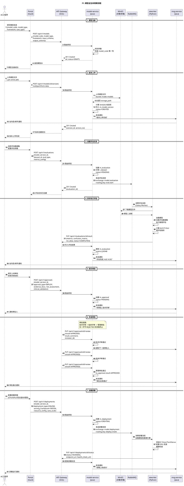
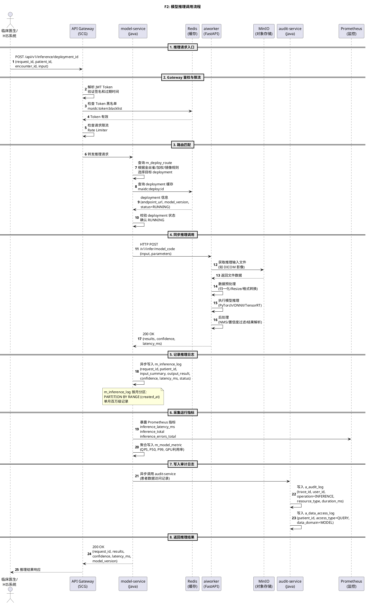
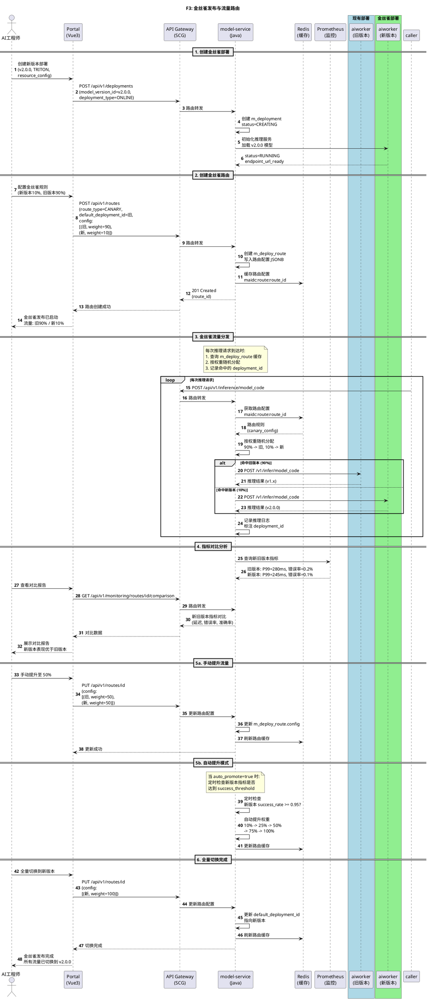
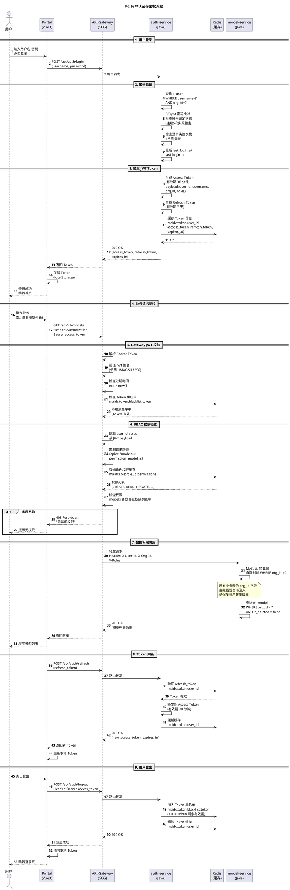
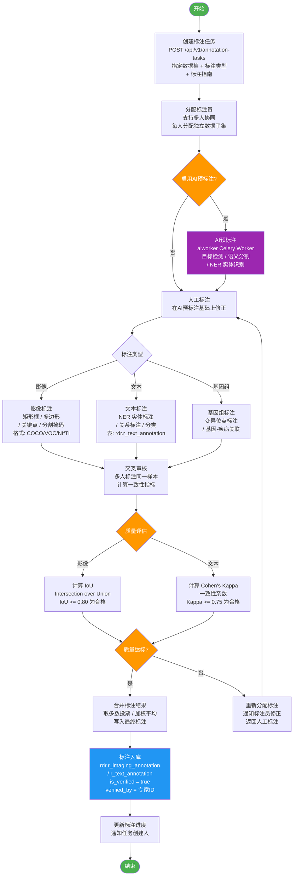
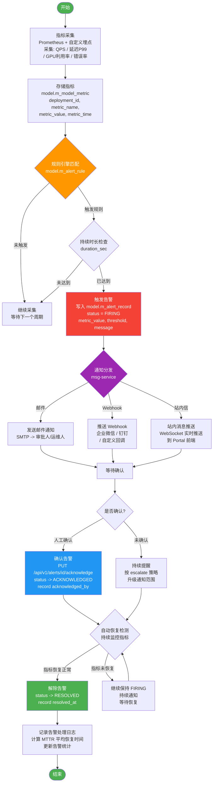

# MAIDC 交互流程图集

> **版本**: v1.0
> **日期**: 2026-04-10
> **项目**: MAIDC - Medical AI Data Center 医疗AI数据中心
> **技术栈**: Spring Cloud Alibaba + Python AI Worker + PostgreSQL + RabbitMQ + MinIO + Redis

---

## 目录

1. [F1: 模型全生命周期流程](#f1-模型全生命周期流程) ★最重要
2. [F2: 模型推理调用流程](#f2-模型推理调用流程)
3. [F3: 金丝雀发布与流量路由](#f3-金丝雀发布与流量路由)
4. [F4: CDR 数据接入流程](#f4-cdr-数据接入流程)
5. [F5: ETL 数据转换管线](#f5-etl-数据转换管线)
6. [F6: 用户认证与鉴权流程](#f6-用户认证与鉴权流程)
7. [F7: 数据标注工作流](#f7-数据标注工作流)
8. [F8: 告警触发与通知流程](#f8-告警触发与通知流程)

---

## F1: 模型全生命周期流程

### 业务背景

模型全生命周期管理是 MAIDC 平台最核心的业务流程，覆盖从模型注册、版本上传、评估验证、多级审批到上线部署的完整链路。该流程涉及前端 Portal、API 网关、模型管理服务、对象存储、AI Worker 集群和消息通知服务六个参与方，通过 RabbitMQ 实现异步解耦，通过多级审批保障模型上线的安全性与合规性。

### 时序图



### 关键说明

| 步骤 | API 接口 | 数据库表 | 说明 |
|------|---------|----------|------|
| 模型注册 | `POST /api/v1/models` | `model.m_model` | 创建模型基础信息，初始状态为 DRAFT |
| 版本上传 | `POST /api/v1/models/{id}/versions` | `model.m_model_version` | multipart 上传模型文件到 MinIO，计算 SHA256 校验 |
| 创建评估 | `POST /api/v1/evaluations` | `model.m_evaluation` | 关联评估数据集（`rdr.r_dataset`），状态 PENDING |
| 异步评估 | RabbitMQ `model.evaluation.queue` | `model.m_evaluation` | model-service 发消息，aiworker Celery Worker 异步执行评估 |
| 评估回调 | `PUT /api/v1/evaluations/{id}/result` | `model.m_evaluation` | aiworker 通过 HTTP 回调写入评估指标（AUC/F1/IoU 等） |
| 提交审批 | `POST /api/v1/approvals` | `model.m_approval` | 附带评审材料、风险评估、临床验证说明 |
| 多级审批 | `PUT /api/v1/approvals/{id}/review` | `model.m_approval` | 技术评审 -> 临床评审 -> 管理审批，任一环节拒绝则流程终止 |
| 创建部署 | `POST /api/v1/deployments` | `model.m_deployment` | 配置资源（CPU/GPU/内存/副本），选择推理框架（Triton/TorchServe） |
| 全程通知 | - | - | model-service 在每个关键节点通过 msg-service 发送通知 |

**状态机**:
- 模型: `DRAFT -> REGISTERED -> PUBLISHED -> DEPRECATED`
- 版本: `CREATED -> TRAINING -> EVALUATING -> APPROVED -> DEPLOYED -> DEPRECATED`
- 审批: `PENDING -> APPROVED / REJECTED`
- 部署: `CREATING -> RUNNING -> STOPPING -> STOPPED / FAILED`

---

## F2: 模型推理调用流程

### 业务背景

模型推理是模型上线后的核心业务动作，由临床系统（HIS）或前端 Portal 发起，经网关路由至 model-service，再通过 FastAPI 同步调用 aiworker 执行推理。推理全程记录推理日志（`m_inference_log`）、采集运行指标、写入审计日志，确保临床 AI 辅助诊断过程可追溯、可审计。

### 时序图



### 关键说明

| 步骤 | API 接口 | 数据库表 | 说明 |
|------|---------|----------|------|
| 推理请求 | `POST /api/v1/inference/{deployment_id}` | - | 支持来自 HIS/PACS 等临床系统的调用 |
| 路由匹配 | 内部查询 `m_deploy_route` | `model.m_deploy_route` | 根据金丝雀/加权/镜像规则路由到目标 deployment |
| 同步推理 | aiworker FastAPI `/v1/infer/{model_code}` | - | HTTP 同步调用，延迟通常在 100-500ms |
| 推理日志 | 内部写入 | `model.m_inference_log` | 按月分区存储，含输入摘要、输出结果、延迟、状态 |
| 指标采集 | 内部聚合 | `model.m_model_metric` | QPS、延迟 P50/P99、GPU 利用率等 |
| 审计日志 | 异步调用 audit-service | `audit.a_audit_log` + `audit.a_data_access_log` | 全链路追踪，含患者数据访问记录 |

**性能要求**: 单次同步推理延迟 P99 < 500ms，推理日志异步写入不阻塞主流程。

---

## F3: 金丝雀发布与流量路由

### 业务背景

金丝雀发布（Canary Release）是模型平滑升级的关键策略。AI 工程师创建新版本部署后，通过部署路由（`m_deploy_route`）将少量流量（如 10%）导向新版本，在监控指标对比验证通过后，逐步或全量切换到新版本。该机制支持手动提升和自动提升两种模式，避免新模型版本上线对临床业务造成影响。

### 时序图



### 关键说明

| 步骤 | API 接口 | 数据库表 | 说明 |
|------|---------|----------|------|
| 创建路由 | `POST /api/v1/routes` | `model.m_deploy_route` | 配置路由类型（CANARY/AB_TEST/WEIGHTED/MIRROR）和流量分配 |
| 流量分配 | 内部逻辑 | `model.m_deploy_route.config` | 按权重随机分配，记录每次请求命中的 deployment |
| 指标对比 | `GET /api/v1/monitoring/routes/{id}/comparison` | `model.m_model_metric` | 对比新旧版本的延迟、错误率、准确率等指标 |
| 手动提升 | `PUT /api/v1/routes/{id}` | `model.m_deploy_route` | 工程师手动调整权重比例，逐步切换 |
| 自动提升 | 内部定时检查 | `model.m_deploy_route.traffic_rules` | 根据 `success_threshold` 自动逐步提升新版本流量 |

**路由类型说明**:
- **CANARY**: 金丝雀发布，按比例分发流量到新旧版本
- **AB_TEST**: A/B 测试，按用户/请求特征分流
- **WEIGHTED**: 加权路由，多个 deployment 按权重分配
- **MIRROR**: 流量镜像，主流量走生产，镜像一份到新版本（不影响线上）

---

## F4: CDR 数据接入流程

### 业务背景

CDR（Clinical Data Repository）数据接入流程实现从外部医院信息系统（HIS/PACS/LIS）到 MAIDC 临床数据仓库的标准化数据同步。流程涵盖数据源注册、增量同步触发、数据字典映射（ICD-10/LOINC/SNOMED CT）、数据质量校验、写入 CDR Schema 以及 Redis 缓存更新，确保临床数据的完整性和标准化。

### 流程图

```mermaid
flowchart TD
    Start([开始]) --> RegSource[注册数据源\nPOST /api/v1/datasources\n表: cdr.c_org]
    RegSource --> ConfigConn[配置连接参数\n{host, port, db_type, auth}\n支持: HIS / PACS / LIS]

    ConfigConn --> TestConn{测试连接\n是否成功?}
    TestConn -->|成功| TrigSync[触发增量同步\n定时(XXL-JOB) / 手动触发]
    TestConn -->|失败| FixConn[排查网络/权限问题]
    FixConn --> ConfigConn

    TrigSync --> Extract[增量数据抽取\n读取 source_system + source_id\n比对 last_sync_time]
    Extract --> DictMap[数据字典映射\nICD-10 诊断编码\nLOINC 检验项目编码\nSNOMED CT 临床术语]

    DictMap --> QualityCheck{数据质量校验\nr_data_quality_rule}
    QualityCheck -->|通过| Transform[数据转换\n脱敏处理(姓名/身份证/电话)\n格式标准化(日期/编码/单位)]
    QualityCheck -->|不通过| Quarantine[隔离问题数据\n记录错误明细\n通知数据管理员]

    Transform --> WriteCDR[写入 CDR Schema\n表: c_patient / c_encounter\n/ c_diagnosis / c_lab_test\n/ c_imaging_exam 等]
    WriteCDR --> UpdateCache[更新 Redis 缓存\n患者基本信息缓存\n科室/医生字典缓存]
    UpdateCache --> SyncLog[记录同步日志\n{records_read, records_written,\nrecords_error, duration}]

    SyncLog --> End([结束])

    Quarantine --> ManualFix[人工修正数据]
    ManualFix --> TrigSync

    style Start fill:#4CAF50,color:#fff
    style End fill:#4CAF50,color:#fff
    style QualityCheck fill:#FF9800,color:#fff
    style Quarantine fill:#F44336,color:#fff
    style WriteCDR fill:#2196F3,color:#fff
    style UpdateCache fill:#9C27B0,color:#fff
```

### 关键说明

| 步骤 | API 接口 | 数据库表 | 说明 |
|------|---------|----------|------|
| 数据源注册 | `POST /api/v1/datasources` | `cdr.c_org` | 注册外部系统连接信息，标记连接状态 |
| 增量同步 | XXL-JOB 定时触发 / 手动 API | - | 基于时间戳增量拉取，避免全量同步 |
| 数据字典映射 | 内部映射服务 | `system.s_dict` | ICD-10/LOINC/SNOMED CT 标准编码映射 |
| 数据质量校验 | `POST /api/quality/rules` | `rdr.r_data_quality_rule` | 完整性/准确性/一致性/唯一性/时效性校验 |
| 写入 CDR | 内部批量写入 | `cdr.c_patient` / `cdr.c_encounter` 等 28 张表 | 采用 UPSERT（INSERT ON CONFLICT UPDATE）避免重复 |
| 缓存更新 | 内部更新 | Redis | 热点数据（患者、科室、医生）写入 Redis 缓存 |
| 同步日志 | 内部记录 | - | 记录本次同步的读取/写入/错误条数和耗时 |

---

## F5: ETL 数据转换管线

### 业务背景

ETL（Extract-Transform-Load）数据转换管线负责将 CDR 临床数据仓库中的标准化数据，按照科研项目的需求转换为研究数据（RDR）。流程包括选择 CDR 数据源、定义转换规则（字段映射、过滤条件、特征提取）、执行 ETL 任务、数据质量检测、写入 RDR Schema、生成数据集版本，最终通知研究员数据集已就绪。

### 流程图

```mermaid
flowchart TD
    Start([开始]) --> SelectCDR[选择 CDR 数据源\n指定患者队列/时间范围\n/科室/诊断等条件]
    SelectCDR --> DefineRule[定义转换规则\nrdr.r_etl_task.etl_config JSONB\n字段映射 / 过滤条件 / 特征提取]

    DefineRule --> ConfigSchedule{调度方式\nMANUAL / SCHEDULED}
    ConfigSchedule -->|手动| Execute[执行 ETL 任务\ndata-service 处理]
    ConfigSchedule -->|定时| CronJob[注册 XXL-JOB 任务\ncron_expression]
    CronJob --> Execute

    Execute --> Extract[Extract 抽取\n从 CDR Schema 读取数据\nSELECT FROM cdr.c_*]
    Extract --> Transform[Transform 转换\n字段重命名 / 类型转换\n特征计算 / 标签生成\n脱敏处理 / 编码标准化]

    Transform --> Load[Load 加载\n批量写入 RDR Schema]
    Load --> DQCheck{数据质量检测\nr_data_quality_rule}

    DQCheck -->|通过| WriteRDR[写入 RDR Schema\nr_clinical_feature\nr_imaging_dataset\nr_text_dataset 等]
    DQCheck -->|不通过| DQFail[记录质量报告\nr_data_quality_result\n标记失败样本]

    WriteRDR --> GenVersion[生成数据集版本\nrdr.r_dataset_version\n{version_no, record_count,\nfile_size, checksum=SHA256}]
    GenVersion --> UpdateStatus[更新数据集状态\nrdr.r_dataset.status = PUBLISHED]

    UpdateStatus --> Notify[通知研究员\nmsg-service 发送站内信\n/邮件/Webhook]
    Notify --> End([结束])

    DQFail --> ManualReview[人工审核质量报告]
    ManualReview --> DefineRule

    style Start fill:#4CAF50,color:#fff
    style End fill:#4CAF50,color:#fff
    style DQCheck fill:#FF9800,color:#fff
    style DQFail fill:#F44336,color:#fff
    style WriteRDR fill:#2196F3,color:#fff
    style GenVersion fill:#9C27B0,color:#fff
```

### 关键说明

| 步骤 | API 接口 | 数据库表 | 说明 |
|------|---------|----------|------|
| 定义转换规则 | `POST /api/etl/tasks` | `rdr.r_etl_task` | etl_config 为 JSONB，存放字段映射和过滤条件 |
| 执行 ETL | `POST /api/etl/tasks/{id}/execute` | `rdr.r_etl_task_log` | 记录每次执行的开始/结束时间、处理条数、错误数 |
| 数据质量检测 | 内部执行 | `rdr.r_data_quality_rule` + `rdr.r_data_quality_result` | 支持完整性/准确性/一致性/唯一性/时效性五类规则 |
| 写入 RDR | 内部批量写入 | `rdr.r_clinical_feature` / `rdr.r_imaging_dataset` / `rdr.r_text_dataset` | 多模态数据分别写入对应的子表 |
| 生成版本 | `POST /api/rdr/datasets/{id}/versions` | `rdr.r_dataset_version` | 语义化版本号，计算 SHA256 校验和 |
| 通知 | msg-service 异步 | - | ETL 完成后通过 msg-service 通知项目相关成员 |

---

## F6: 用户认证与鉴权流程

### 业务背景

MAIDC 采用 JWT + RBAC 的认证鉴权方案。用户登录时由 auth-service 验证密码并签发 JWT Token，Token 缓存在 Redis 中。后续请求经过 Gateway 统一拦截校验 JWT 有效性，再通过 RBAC 权限模型检查用户是否具备操作权限，最后通过 `org_id` 实现多租户数据权限隔离。

### 时序图



### 关键说明

| 步骤 | API 接口 | 数据库表 | 说明 |
|------|---------|----------|------|
| 登录 | `POST /api/auth/login` | `system.s_user` | BCrypt 密码验证，连续 5 次失败锁定账号 |
| Token 签发 | 内部生成 | - | Access Token 30 分钟过期，Refresh Token 7 天过期 |
| Token 缓存 | - | Redis `maidc:token:{user_id}` | Token 信息缓存到 Redis，支持主动失效（登出/踢下线） |
| JWT 校验 | Gateway 全局过滤器 | Redis | 解析 JWT 验证签名和过期时间，检查 Redis 黑名单 |
| RBAC 权限 | Gateway 权限过滤器 | `system.s_user_role` / `system.s_role_permission` / `system.s_permission` | 用户 -> 角色 -> 权限三级模型，支持菜单/API/按钮/数据级权限 |
| 数据权限 | 业务服务拦截器 | 所有业务表的 `org_id` 字段 | 通过 MyBatis 拦截器自动附加 `WHERE org_id = ?` 条件 |
| Token 刷新 | `POST /api/auth/refresh` | - | 使用 Refresh Token 换取新 Access Token，无需重新登录 |

---

## F7: 数据标注工作流

### 业务背景

数据标注是 AI 模型训练数据准备的关键环节。MAIDC 支持多模态数据标注（影像/文本/基因组），通过 AI 辅助预标注提高标注效率，采用多人交叉标注和质量评估（Cohen's Kappa/IoU）保障标注质量，最终将高质量标注数据入库，供模型训练使用。

### 流程图



### 关键说明

| 步骤 | API 接口 | 数据库表 | 说明 |
|------|---------|----------|------|
| 创建标注任务 | `POST /api/v1/annotation-tasks` | 自定义标注任务表 | 指定数据集、标注类型（BBOX/SEGMENTATION/NER/CLASSIFICATION）、标注指南 |
| AI 预标注 | RabbitMQ `preprocessing` 队列 | - | aiworker Celery Worker 调用预训练模型生成初始标注 |
| 影像标注 | 前端标注工具 | `rdr.r_imaging_annotation` | 支持矩形框、多边形、关键点、分割掩码，格式 COCO/VOC/NIfTI/DICOM-Seg |
| 文本标注 | 前端标注工具 | `rdr.r_text_annotation` | 支持 NER 实体标注、关系标注、分类，记录文本偏移量 |
| 交叉审核 | 内部逻辑 | - | 多人标注同一样本，计算一致性指标 |
| 质量评估 | 内部计算 | - | 影像用 IoU（>= 0.80），文本用 Cohen's Kappa（>= 0.75） |
| 标注入库 | `PUT /api/v1/annotations/{id}/verify` | `rdr.r_imaging_annotation` / `rdr.r_text_annotation` | 设置 `is_verified = true`，记录审核人 |

---

## F8: 告警触发与通知流程

### 业务背景

MAIDC 的告警体系基于 Prometheus 指标采集和自定义告警规则（`m_alert_rule`），实现对模型推理性能、资源利用率、系统可用性的全方位监控。当指标触发告警规则时，系统生成告警记录并通过多渠道（邮件/Webhook/站内信）分发通知，支持告警确认、自动恢复检测和解除告警的完整生命周期管理。

### 流程图



### 关键说明

| 步骤 | API 接口 | 数据库表 | 说明 |
|------|---------|----------|------|
| 指标采集 | Prometheus + 自定义埋点 | `model.m_model_metric` | 采集 QPS、延迟 P50/P99、GPU 利用率、错误率等指标 |
| 规则匹配 | 内部定时检查 | `model.m_alert_rule` | 支持 GT/GTE/LT/LTE/EQ/NE 条件，可配置持续时长阈值 |
| 触发告警 | 内部生成 | `model.m_alert_record` | 状态 FIRING，记录触发时间、指标值、阈值、告警消息 |
| 通知分发 | msg-service 异步 | - | 支持邮件（SMTP）、Webhook（企业微信/钉钉）、站内信（WebSocket） |
| 确认告警 | `PUT /api/v1/alerts/{id}/acknowledge` | `model.m_alert_record` | 状态转为 ACKNOWLEDGED，记录确认人和时间 |
| 解除告警 | 内部检测 | `model.m_alert_record` | 指标恢复正常后自动解除，记录恢复时间，计算 MTTR |
| 持续提醒 | msg-service | - | 未确认的告警按升级策略扩大通知范围 |

**告警严重级别**:
- **CRITICAL**: 需要立即处理，如推理服务不可用、错误率 > 10%
- **WARNING**: 需要关注，如延迟 P99 > 500ms、GPU 利用率 > 90%
- **INFO**: 信息提示，如部署状态变更、配置修改

---

## 附录：流程与服务映射关系

| 流程编号 | 流程名称 | 主要参与服务 | 涉及 Schema |
|----------|----------|-------------|-------------|
| F1 | 模型全生命周期 | model-service, aiworker, msg-service, MinIO | model |
| F2 | 模型推理调用 | Gateway, model-service, aiworker, audit-service | model, audit |
| F3 | 金丝雀发布与流量路由 | model-service, aiworker | model |
| F4 | CDR 数据接入 | data-service, XXL-JOB | cdr, system |
| F5 | ETL 数据转换管线 | data-service, XXL-JOB | cdr, rdr |
| F6 | 用户认证与鉴权 | Gateway, auth-service, Redis | system |
| F7 | 数据标注工作流 | label-service, aiworker | rdr |
| F8 | 告警触发与通知 | model-service, msg-service, Prometheus | model |

---

> **文档结束** - MAIDC 交互流程图集 v1.0
